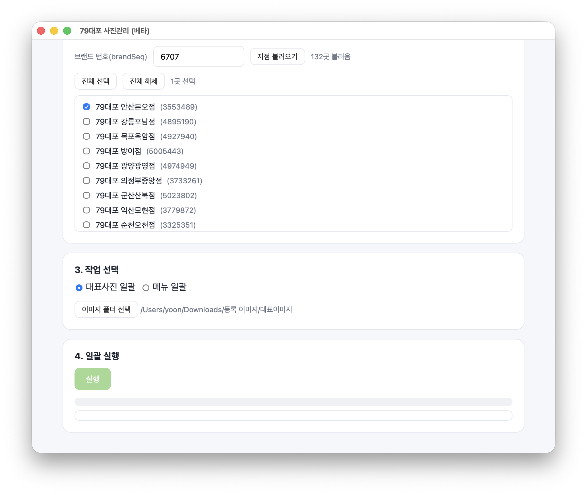
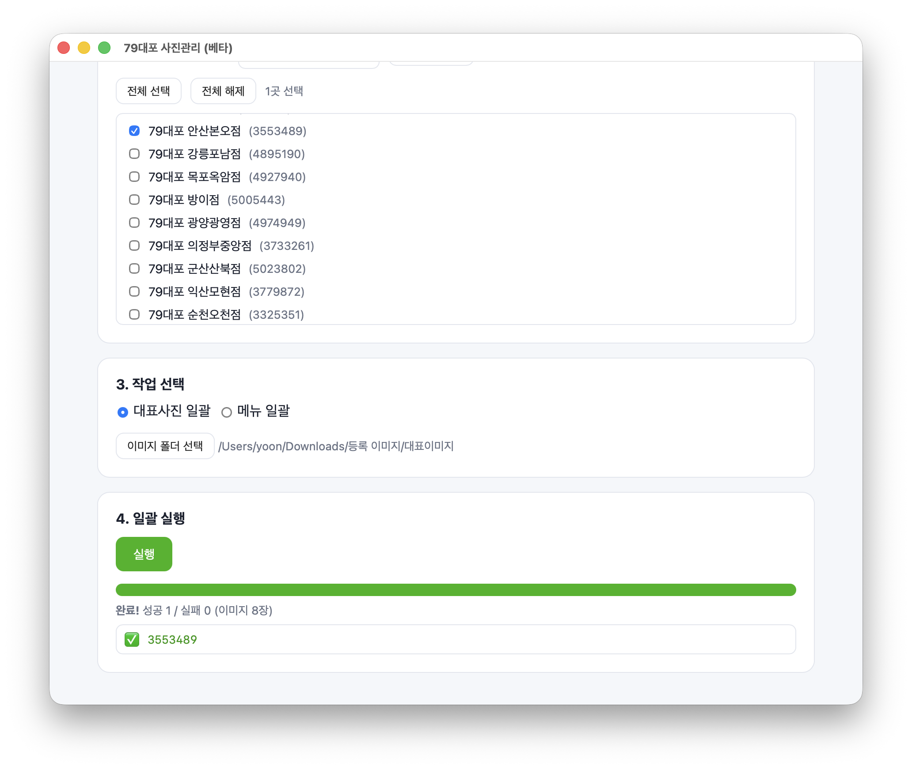

<p align="right"><b>한국어</b> · <a href="README.en.md">English</a></p>

# 📷 SmartPlace Bulk — 네이버 스마트플레이스 일괄 관리

> 프랜차이즈 본사를 위한 **대표사진·메뉴 전 지점 일괄 등록 데스크톱 앱**
> 네이버 로그인 → 지점 자동 불러오기 → 사진/메뉴 한 번에 일괄 적용

> ⚠️ **사용 전 반드시 [면책 고지(DISCLAIMER)](DISCLAIMER.md)를 읽어주세요.**
> 이 도구는 네이버와 무관한 비공식 도구이며, 자동화는 네이버 약관과 충돌할 수 있습니다. 사용에 따른 책임은 사용자에게 있습니다. **본인 소유/관리 지점에만 사용하세요.**

---

## 미리보기
<p align="center">
  
  
</p>

## 무엇을 하나요?
수십~수백 개 지점을 가진 프랜차이즈가, 네이버 스마트플레이스에서 **지점마다 하나씩** 하던 작업을 **한 번에**:
- 🖼️ **대표사진 일괄 등록** — 표준 이미지를 전 지점에 (대표사진으로 설정)
- 🍽️ **메뉴 일괄 등록** — 표준 메뉴(CSV)를 전 지점에 통일 (이름·가격·설명·사진)
- 🏷️ 지점 목록 자동 스크랩 (브랜드 전 지점)

**고객 PC에서 고객 네이버로 실행** → 로그인 정보가 PC를 떠나지 않습니다 (Local-First).

> 🚀 **어떻게 시작하나요?**
> · 그냥 **쓰고 싶다** → 아래 [다운로드 & 설치](#다운로드--설치) (설치 불필요, 더블클릭)
> · **코드를 직접 돌려보거나 기여하고 싶다** → [⚡ 소스에서 5분 실행](#-소스에서-5분-실행-개발자기여자용)

## 다운로드 & 설치
[**▶ 최신 버전 다운로드 (Releases)**](../../releases/latest)

| OS | 받는 것 | 가이드 |
|---|---|---|
| **Windows** | `SmartPlacePhoto-windows.zip` → 압축 풀고 `.exe` 실행 | [윈도우 가이드](desktop/윈도우_실행가이드.md) |
| **Mac** | 소스 실행(`run.command`) | [쉬운 가이드](desktop/처음하는분_쉬운가이드.md) |

> Windows에서 "PC 보호" 경고가 뜨면 → "추가 정보" → "실행" (서명 안 된 앱이라 뜨는 정상 경고)

## 사용법 (4단계)
1. **네이버 로그인** — 버튼 누르면 로그인 창. 직접 로그인(캡차·2차인증 포함)
2. **지점 불러오기** — 브랜드 번호 입력 → 전 지점 자동 표시
3. **작업 선택** — 대표사진(폴더) 또는 메뉴(CSV)
4. **일괄 실행** — 진행률 보며 한 곳씩 적용

메뉴 CSV 형식: [`desktop/menu_template.csv`](desktop/menu_template.csv) 참고
```
name,price,description,image,recommended
빠삭파전,6900,겉바속촉 빠삭파전,pajeon.jpg,Y
```

> 💡 처음엔 **꼭 한 지점만** 선택해 테스트하세요 (실제로 등록됩니다).

## 안전·개인정보
- 네이버 로그인 세션은 **사용자 PC에만** 저장, 외부 전송 없음
- 봇 탐지 방지를 위해 지점 간 간격을 두고 천천히 처리
- 자세한 한계·위험은 [DISCLAIMER](DISCLAIMER.md) 참고

---

## ⚡ 소스에서 5분 실행 (개발자·기여자용)

> 완성된 앱만 쓸 거면 위 [다운로드 & 설치](#다운로드--설치)로 충분합니다.
> 코드를 직접 돌려보거나 기여하려면 아래 3단계면 됩니다.

**전제**: Python 3.12+ 하나면 됩니다. (데스크톱 앱만 띄울 거라 Node·DB·클라우드 불필요)

**① 클론**
```bash
git clone https://github.com/yuneunmi814-cmyk/smartplace-cloud.git
cd smartplace-cloud/desktop
```

**② 실행** — 둘 중 편한 방법으로:

- 🖱️ **가장 쉬움**: 파일 탐색기에서 **`run.command`(Mac)** 또는 **`run.bat`(Windows)** 더블클릭 → 처음엔 자동으로 설치하고 앱이 뜹니다.
- ⌨️ **터미널로**:
  ```bash
  python3 -m venv .venv && source .venv/bin/activate   # Windows: .venv\Scripts\activate
  pip install -r requirements.txt
  playwright install chromium                          # 한 번만 (가장 오래 걸리는 단계)
  python app.py
  ```

**③ 앱 창이 뜨면 성공!** 🎉 4단계 화면(로그인 → 지점 → 작업 → 실행)이 보입니다.

> 실제 등록을 해보려면 **본인 네이버 계정으로 로그인**하고 본인이 관리하는 브랜드 번호가 필요합니다.
> (로그인 정보는 PC를 떠나지 않습니다. 처음엔 **꼭 한 지점만** 테스트하세요.)

<details>
<summary>잘 안 될 때</summary>

- `python3` 없음 → [python.org](https://www.python.org/downloads/)에서 3.12+ 설치 (Windows는 설치 시 "Add to PATH" 체크)
- `playwright install` 멈춤 → 네트워크 문제. Chromium(약 150MB) 다운로드라 와이파이가 느리면 5분을 넘길 수 있어요. 다시 실행하면 이어받습니다.
- macOS에서 `run.command`가 "확인되지 않은 개발자" → 우클릭 → "열기" 한 번.
</details>

### 전체 스택(클라우드)까지 돌려보려면
백엔드(FastAPI) + 웹 콘솔(React) + 게이트웨이까지 띄우는 방법은 **[HANDOFF.md](HANDOFF.md)** 에 단계별로 있습니다.

### 저장소 구성
```
desktop/   데스크톱 앱(pywebview + Playwright) — 배포되는 실행파일 ← 위 퀵스타트 대상
gateway/   CLI 자동화 도구(일괄 사진/메뉴, 브랜드 스크랩)
backend/   FastAPI 백엔드(다계정·작업 큐·S3·라이선스/구독) + 테스트
web/       React 관리 콘솔(이미지·배포·라이선스 관리)
```
빌드: `.github/workflows/build-windows-exe.yml` (GitHub Actions에서 Windows .exe 자동 빌드)

## 라이선스
MIT License — 단, [면책 고지](DISCLAIMER.md)의 사용 제한을 따르세요.
